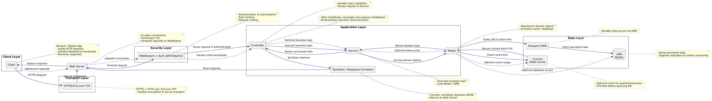

# real-time-backend-architecture

Production-grade backend architecture blueprint
supporting REST APIs and real-time WebSocket communication.



## Purpose

This repository documents a production-grade backend architecture
designed to support:

- Secure REST APIs
- Real-time WebSocket communication
- Scalable data access with caching
- Clear separation of concerns

The goal is to serve as:
- A system design reference
- A blueprint for future implementation
- An architectural discussion artifact

## 🧱 Architecture Overview

The system follows a layered architecture:

- **Client Layer** – Browser / Mobile App
- **Transport Layer** – HTTPS (TLS over TCP)
- **Web Server** – Connection handling & TLS termination
- **Security Layer** – Middleware, Authentication, Authorization
- **Application Layer** – MVC-style (Controller, Service, Model)
- **Data Layer** – Redis Cache, ORM, Database
- **Real-Time Layer** – WebSocket connections

This architecture supports **scalable, secure, and real-time applications**.

---

## 🔁 Scenario 1: Synchronous HTTPS Request Flow

### 🎯 Example Use Case
A logged-in user clicks **“View My Profile”**.

### 1️⃣ Client Layer
The client:

- Sends an HTTP request:
  - `GET /api/profile`
- Includes:
  - `Authorization: Bearer <JWT>`

The client has no knowledge of backend internals.

### 2️⃣ Transport Layer (HTTPS / TLS over TCP)
- Request is encrypted using TLS
- Delivered reliably over TCP

This protects data from interception or tampering.

### 3️⃣ Web Server
The Web Server (e.g. Nginx / Apache):

- Accepts the connection
- Terminates TLS
- Parses the HTTP request
- Forwards the request internally

No business logic is executed here.

### 4️⃣ Security Layer (Middleware + Authentication)
Middleware performs:

- JWT validation
- Authentication & authorization
- Rate limiting
- Request routing

If authentication fails, the request is rejected immediately.

### 5️⃣ Controller
The Controller:

- Receives a validated request
- Extracts user identity
- Validates input
- Routes the request to the appropriate Service

Controllers orchestrate; they do not execute business logic.

### 6️⃣ Service Layer
The Service:

- Executes business rules
- Enforces permissions
- Coordinates domain operations
- Requests data from the Model

This is where application logic lives.

### 7️⃣ Model Layer
The Model:

- Represents domain entities
- Determines how data is retrieved

First action:
- Check Redis cache for existing data

### 8️⃣ Cache & Database Access
- **Cache hit** → return data immediately
- **Cache miss** → query database via ORM

The database remains the single source of truth.

### 🔁 Response Flow
- Model → Service → Controller
- Controller passes data to Serializer

### 🔟 Serializer / Response Formatter
- Converts internal domain objects into JSON
- Ensures API-safe output

Example:
```json
{
  "id": 12,
  "name": "Alice",
  "email": "alice@example.com"
}
```
---

### Scenario 2: WebSocket Real-Time Flow

## 1️⃣ Client Initiates WebSocket Connection

The client (Browser / Mobile App):

- Sends an HTTP request with:
  - `Upgrade: websocket`
  - `Connection: Upgrade`
  - `Authorization: Bearer <JWT>`

This request is still an **HTTP request**, used only to establish the WebSocket connection.

## 2️⃣ Transport Layer (TLS over TCP)

- The WebSocket handshake is:
  - Encrypted via TLS
  - Transmitted over TCP
- Secure channel is established before upgrade

This guarantees confidentiality and integrity.

## 3️⃣ Web Server Upgrades the Connection

The Web Server:

- Accepts the connection
- Validates protocol upgrade
- Switches from HTTP → WebSocket
- Keeps the connection **open and persistent**

At this point:
- No more request/response cycles
- Bi-directional communication is enabled

## 4️⃣ Security Layer Validates Handshake

During the handshake:

- JWT token is verified
- User identity is authenticated
- User context is attached to the socket session

🔐 **Important rule**:
- Authentication happens **once per connection**
- Messages do not re-pass HTTP middleware

## 5️⃣ Controller Registers the Connection

The Controller:

- Receives the authenticated WebSocket session
- Registers the socket in memory
- Maps:
  - Socket ID → User ID
- Prepares the system for event delivery

The Controller does **not** process business logic.

## 6️⃣ Real-Time Event Occurs

Example event:
- A new message is sent to the user
- A system alert is triggered
- A background job emits an update

This event originates **inside the system**, not from the client.

## 7️⃣ Service Layer Processes the Event

The Service:

- Applies business rules
- Determines:
  - Who should receive the message
  - What data should be included
- Requests domain data if required

This ensures real-time events respect the same rules as HTTP APIs.

## 8️⃣ Model Layer Access (Optional)

If data is needed:

- Model checks Redis cache first
- If cache miss → query database
- Domain objects are prepared

Not every WebSocket message requires database access.

## 9️⃣ Message Serialization

Before sending:

- Domain data is converted into a safe JSON payload
- Internal fields are hidden
- API contract is preserved

Example:
```json
{
  "type": "notification",
  "message": "You have a new message",
  "timestamp": "2026-02-10T14:32:00Z"
}
```
---

## 🔐 Security Model

The system follows a **defense-in-depth** approach:

- **Transport Security**
  - All communication occurs over HTTPS (TLS over TCP)
  - TLS is terminated at the Web Server

- **Authentication**
  - HTTP requests are authenticated per request using JWT
  - WebSocket connections are authenticated once during the handshake

- **Authorization**
  - Access control is enforced at the Service layer
  - Business rules and permissions apply to both HTTP and WebSocket flows

- **Middleware Protection**
  - Rate limiting and request validation occur before application logic
  - Unauthorized requests are rejected early

- **Session Integrity**
  - WebSocket sessions are bound to authenticated user identity
  - Invalid or expired sessions are disconnected

This model ensures consistent security guarantees across synchronous and real-time communication.

---

## 🗺️ Roadmap

This repository is intended to evolve as an architectural reference.

Planned improvements include:

- [x] High-level system architecture definition
- [x] Runtime flow documentation (HTTP + WebSocket)
- [ ] Sequence diagrams for request and event flows
- [ ] Failure and edge-case analysis (auth failure, cache miss, disconnects)
- [ ] Scalability considerations (horizontal scaling, message fan-out)
- [ ] Optional minimal reference implementation

The absence of production code is intentional; the focus is on **architecture, clarity, and design reasoning**.

